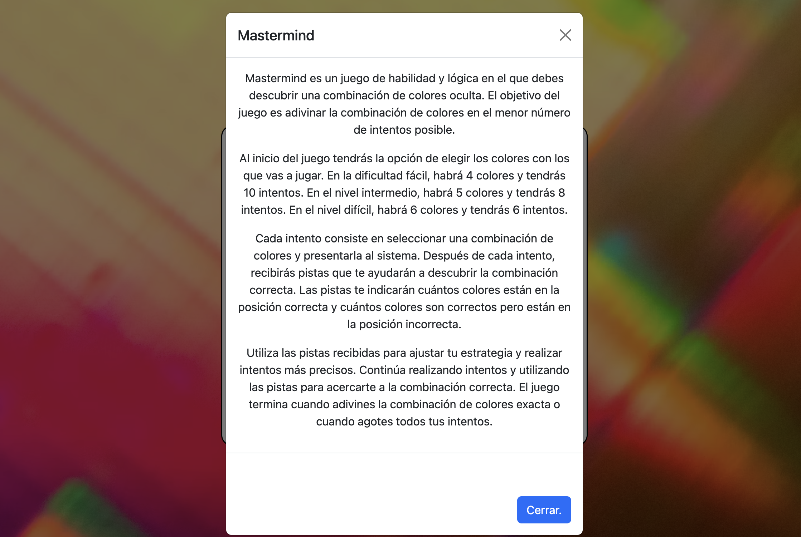
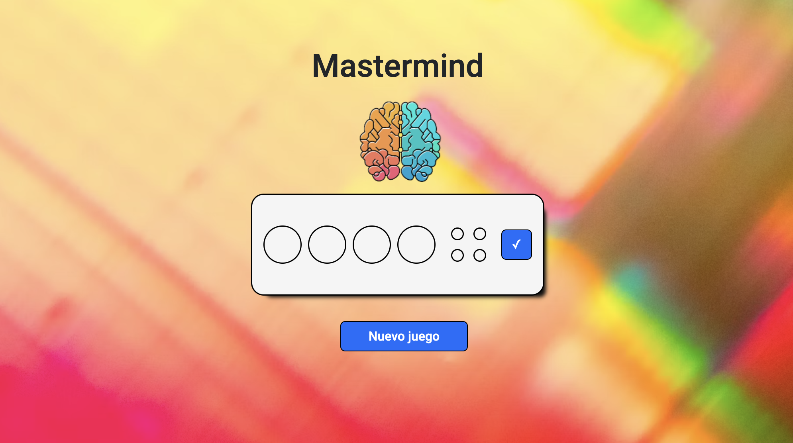
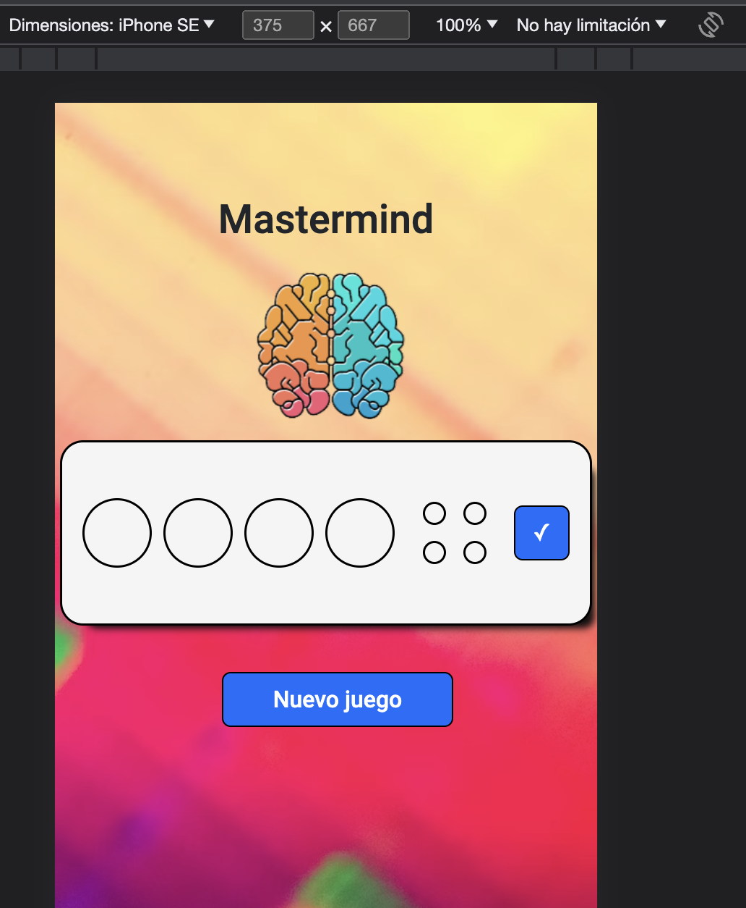

# Bienvenidos a mi Mastermind.

<!-- <details>
  <summary>Contenido 📝</summary>
  <ol>
    <li><a href="#objetivo-🎯">Objetivo</a></li>
    <li><a href="#sobre-el-proyecto-🔎">Sobre el proyecto</a></li>
    <li><a href="#deploy-🚀">Deploy</a></li>
    <li><a href="#stack">Stack</a></li>
    <li><a href="#instalación-en-local">Instalación</a></li>
    <li><a href="#vistas">Vistas</a></li>
    <li><a href="#futuras-funcionalidades">Futuras funcionalidades</a></li>
    <li><a href="#licencia">Licencia</a></li>
    <li><a href="#webgrafia">Webgrafia</a></li>
    <li><a href="#desarrollo">Desarrollo</a></li>
    <li><a href="#agradecimientos">Agradecimientos</a></li>
    <li><a href="#contacto">Contacto</a></li>
  </ol>
</details>

## Objetivo 🎯

Realizacion del juego Mastermind, con Html5,Css3 y Javascript.

## Sobre el proyecto 🔎

Es un proyecto realizado para el Bootcamp Frontend Developers de GeekHubs.

## Deploy 🚀

<div align="center">
    <a href="https://www.google.com"><strong>Url a producción </strong></a>🚀🚀🚀
</div>

## Stack

<a href="https://developer.mozilla.org/es/docs/Web/JavaScript">
    
</a>
 </div>

## Instalación en local

1. Clonar el repositorio
2. `$ npm install`
3. `$ npm run dev`
4. ...

## Vistas

Landing

Parametros

Instrucciones

Vista Game

Responsive


## Futuras funcionalidades

✅ Funcionalidad del Juego.
⬜ Traspasar el codigo a Typescript.
⬜ ...

## Licencia

Este proyecto se encuentra bajo licencia de "Maxi Chavez"

## Webgrafia:

Para conseguir mi objetivo he recopilado información de:

- link a repositorios
- link a documentacion de librerias externas
- ...

## Desarrollo:

```js
const developer = "datata";

console.log("Desarrollado por: " + datata);
```

## Agradecimientos:

Agradezco a mis compañeros y docentes el tiempo dedicado a este proyecto:

- **_Maxi_**
  <a href="https://github.com/Maxigamble" target="_blank"></a>

## Contacto

<a href = "mailto:chavezmaxi@gmail.com"></a>
<a href="https://www.linkedin.com/in/linkedinUser/" target="_blank"></a>

</p> -->
